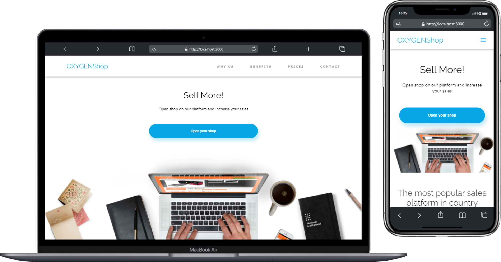

---
# Oxygen Shop
Esto es una solución a un proyecto del Training en Oxygen en los modulos 1 y 2, que consisten en desarrollar con html, css y javascript nativo.

## Table of contents
- [Oxygen Shop](#oxygen-shop)
  - [Table of contents](#table-of-contents)
  - [Overview](#overview)
    - [Links](#links)
  - [Tecnologías](#tecnologías)
    - [Clona este repositorio](#clona-este-repositorio)
  - [Autora](#autora)
## Overview


### Links

- Demo : [https://tkadyear.github.io/oxygen-shop/](https://tkadyear.github.io/oxygen-shop/)

## Tecnologías
- Maquetación: HTML5
- Estilos: CSS nativo.
- Funcionalidad: Javascript vanilla
- Empaquetador: Vite

### Clona este repositorio
```bash
# Clona este repositorio
$ git clone https://github.com/TKadyear/oxygen-shop.git

# Entra en la carpeta
$ cd oxygen-shop

# Instala las dependencias
$ npm install

# Inicia el servidor de desarrollo
$ npm run dev
```
Para ver el servidor de producción, ejecuta los siguientes comandos:
```bash
# Para preparar los documentos para producción:
$ npm run build

# Inicia el servidor de desarrollo
$ npm run preview
```


## Autora
- Github - [TKadyear](https://github.com/TKadyear)
- Linkedin - [Tamara Kadyear Saber](https://www.linkedin.com/in/tamara-kadyear-saber/)
